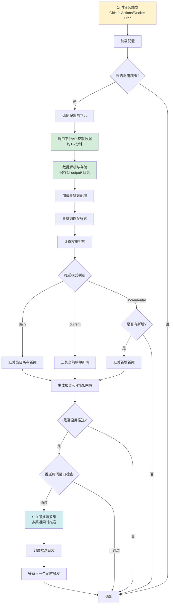

# TrendRadar 项目详细分析报告

## 📋 项目概览

**TrendRadar** 是一个智能热点新闻聚合与推送系统，旨在帮助用户从"被算法推荐绑架"转变为"主动获取自己想要的信息"。

- **项目名称**: TrendRadar
- **当前版本**: v3.5.0
- **许可证**: GPL-3.0
- **主要语言**: Python 3.10+
- **项目定位**: 轻量、易部署的热点助手

---

## 🎯 核心价值与定位

### 解决的问题
1. **信息过载**: 用户被各平台算法推荐绑架，难以获得真正关心的信息
2. **碎片化关注**: 需要在多个平台间切换查看热点
3. **缺乏个性化**: 无法根据个人关键词精准筛选内容
4. **时效性需求**: 投资者、自媒体等需要第一时间获知相关信息

### 目标用户
- **投资者/交易员**: 监控市场热点和投资机会
- **自媒体人/内容创作者**: 追踪热门话题和趋势
- **企业管理者**: 关注行业动态和品牌舆情
- **普通用户**: 关心时事的用户，避免无效刷屏

---

## 🏗️ 系统架构

### 整体架构图

```
┌─────────────────────────────────────────────────────────┐
│                     TrendRadar 系统                       │
├─────────────────────────────────────────────────────────┤
│                                                           │
│  ┌──────────────┐    ┌──────────────┐    ┌───────────┐ │
│  │  数据采集层   │    │  数据处理层   │    │ 推送服务层 │ │
│  │              │───▶│              │───▶│           │ │
│  │ • 多平台爬虫 │    │ • 关键词筛选 │    │ • 多渠道   │ │
│  │ • NewsNow    │    │ • 权重排序   │    │ • 多账号   │ │
│  │ • 自定义源   │    │ • 报告生成   │    │ • 定时推送 │ │
│  └──────────────┘    └──────────────┘    └───────────┘ │
│                                                           │
│  ┌───────────────────────────────────────────────────┐   │
│  │           AI 分析层 (MCP 服务) (可选)              │   │
│  │  • 自然语言查询  • 趋势分析  • 情感分析            │   │
│  │  • 数据洞察     • 智能摘要  • 相似新闻查找        │   │
│  └───────────────────────────────────────────────────┘   │
│                                                           │
└─────────────────────────────────────────────────────────┘
```

### 模块划分

#### 1. **数据采集模块** (`platforms/`)
```
platforms/
├── base.py              # 平台抽象基类
├── factory.py           # 平台工厂（注册表模式）
├── data_fetcher.py      # 统一数据获取器
└── sources/             # 具体平台实现
    ├── newsnow.py       # NewsNow API 平台（11+平台）
    ├── blockbeats_news.py
    ├── wushuo.py
    ├── panews.py
    └── binance_news.py
```

**设计特点**:
- ✅ **插件化架构**: 通用代码与数据源实现分离
- ✅ **易于扩展**: 添加新平台只需在 `sources/` 添加文件
- ✅ **统一接口**: 所有平台继承 `BasePlatform` 基类

#### 2. **核心处理模块** (`main.py`)
- **新闻爬取**: 从配置的平台抓取热点数据
- **关键词匹配**: 支持5种语法（普通词、必须词、过滤词、数量限制、全局过滤）
- **权重排序算法**: 排名权重(60%) + 频次权重(30%) + 热度权重(10%)
- **报告生成**: HTML网页 + 推送消息格式化

#### 3. **推送通知模块**
支持 **9 种推送渠道**:
1. **企业微信** (WeWork) - 支持推送到个人微信
2. **飞书** (Feishu)
3. **钉钉** (DingTalk)
4. **Telegram**
5. **邮件** (Email) - 支持10+种邮箱自动识别
6. **ntfy** - 开源推送服务
7. **Bark** - iOS 专属推送
8. **Slack** - 团队协作工具
9. **GitHub Pages** - 网页版报告

**v3.5.0 新特性**: 所有渠道支持**多账号推送**（使用分号分隔）

#### 4. **AI 分析模块** (`mcp_server/`)
基于 **MCP (Model Context Protocol)** 协议，提供14种分析工具:

```
mcp_server/
├── server.py           # FastMCP 2.0 服务器
├── services/           # 服务层
│   ├── data_service.py      # 数据访问服务
│   ├── parser_service.py    # 数据解析服务
│   └── cache_service.py     # 缓存服务
├── tools/              # 工具层（14个工具）
│   ├── data_query.py        # 基础查询（4个工具）
│   ├── search_tools.py      # 智能检索（2个工具）
│   ├── analytics.py         # 高级分析（5个工具）
│   ├── config_mgmt.py       # 配置管理（1个工具）
│   └── system.py            # 系统管理（2个工具）
└── utils/              # 工具函数
    ├── date_parser.py       # 日期解析
    ├── validators.py        # 参数验证
    └── errors.py            # 错误处理
```

**AI 工具分类**:
- **基础查询**: 获取最新新闻、按日期查询、获取热门话题、按平台查询
- **智能检索**: 关键词搜索、模糊搜索、相似新闻查找、历史关联检索
- **高级分析**: 话题趋势分析、数据洞察、情感分析、智能摘要生成
- **系统管理**: 配置查询、系统状态、触发爬取

---

## 🔑 核心功能详解

### 1. 全网热点聚合

**支持的平台**:
- 社交类: 微博、知乎、抖音、贴吧
- 新闻类: 今日头条、百度热搜、澎湃新闻、凤凰网
- 财经类: 华尔街见闻、财联社热门
- Web3类: 律动Web3、吴说、Panews、币安广场
- 其他: Bilibili热搜、Hacker News、酷安等

**数据来源**: 
- 主要使用 [newsnow](https://github.com/ourongxing/newsnow) 项目的 API
- 支持自定义平台扩展

### 2. 智能关键词筛选

**五种语法**:

| 语法类型 | 符号 | 作用 | 示例 |
|---------|------|------|------|
| 普通词 | 无 | 基础匹配 | `华为` |
| 必须词 | `+` | 限定范围 | `+手机` |
| 过滤词 | `!` | 排除干扰 | `!广告` |
| 数量限制 | `@` | 控制显示 | `@10` |
| 全局过滤 | `[GLOBAL_FILTER]` | 全局排除 | 见配置 |

**配置示例**:
```txt
[GLOBAL_FILTER]
广告
推广
震惊

[WORD_GROUPS]
华为
OPPO
+发布
!维修

特斯拉
马斯克
@5
```

**匹配逻辑**:
1. 全局过滤（优先级最高）→ 直接排除
2. 词组内过滤词 → 排除匹配
3. 必须词检查 → 必须同时包含
4. 普通词匹配 → 包含任意一个即可

### 3. 三种推送模式

**执行机制**: 所有模式都是**定时执行，实时推送**。

| 模式 | 推送时机 | 显示内容 | 适用场景 |
|------|---------|---------|---------|
| **daily** | 定时触发后立即推送 | 当日所有匹配新闻 | 日报总结、全面了解趋势 |
| **current** | 定时触发后立即推送 | 当前榜单匹配新闻 | 定时追踪热点变化 |
| **incremental** | 定时触发后，有新增则立即推送 | 新出现的匹配新闻 | 避免重复，零打扰 |

**执行频率配置**:
- **GitHub Actions**: 默认每小时执行（可修改 `.github/workflows/crawler.yml` 中的 cron 表达式）
- **Docker**: 默认每30分钟执行（可通过环境变量 `CRON_SCHEDULE` 配置）
- **最短间隔**: 建议不少于 30 分钟，避免过度消耗资源

**推送特点**:
- ⚡ **立即推送**: 数据采集和处理完成后，立即发送推送消息，不延迟
- 🔔 **多渠道并行**: 配置的所有推送渠道同时发送
- ⏱️ **延迟时间**: 从定时触发到收到推送，通常只需要 1-3 分钟

### 4. 个性化热点算法

**权重计算公式**:
```python
总权重 = (排名分数 × 排名权重) + (频次分数 × 频次权重) + (热度分数 × 热度权重)
```

**默认权重配置**:
- 排名权重: 60% - 看重排名高的新闻
- 频次权重: 30% - 关注持续出现的话题
- 热度权重: 10% - 考虑排名质量

**可自定义调整**，满足不同需求:
- **追实时热点型**: 排名权重 80%, 频次权重 10%
- **追深度话题型**: 排名权重 40%, 频次权重 50%

### 5. 热点趋势分析

**追踪维度**:
- ⏰ **时间轴追踪**: 记录新闻从首次到最后的完整时间跨度
- 📊 **热度变化**: 统计不同时间段的排名变化和出现频次
- 🆕 **新增检测**: 实时识别新热点，用标记第一时间提醒
- 🔄 **持续性分析**: 区分一次性热点和持续发酵的深度新闻
- 📈 **跨平台对比**: 同一新闻在不同平台的排名表现

### 6. 推送时间窗口控制（可选）

**功能**: 限制推送的时间范围，避免非工作时间打扰

**配置示例**:
```yaml
push_window:
  enabled: true
  time_range:
    start: "09:00"  # 开始时间
    end: "18:00"    # 结束时间
  once_per_day: true  # 每天只推送一次
```

---

## 🚀 部署方式

### 方式一: GitHub Actions 部署（云端，免费）

**优势**:
- ✅ 30秒快速部署（一键 Fork）
- ✅ 无需服务器，零成本
- ✅ 自动定时运行
- ✅ 支持 GitHub Pages 网页版

**限制**:
- ⚠️ GitHub Actions 资源有限额
- ⚠️ 执行时间可能有 ±15 分钟偏差
- ⚠️ 不建议配置过多平台（建议 10 个左右）

### 方式二: Docker 部署（本地，推荐）

**镜像**:
- `wantcat/trendradar` - 新闻推送服务（必选）
- `wantcat/trendradar-mcp` - AI 分析服务（可选）

**优势**:
- ✅ 完全自主控制
- ✅ 精准定时推送
- ✅ 数据本地存储
- ✅ 支持多架构（amd64/arm64）

**快速启动**:
```bash
git clone https://github.com/sansan0/TrendRadar.git
cd TrendRadar/docker
docker-compose up -d
```

### 方式三: 本地运行

适合开发者和需要深度定制的用户。

---

## 🤖 AI 智能分析功能

### MCP 协议支持

**Model Context Protocol (MCP)** 是 Anthropic 推出的标准协议，允许 AI 客户端（如 Claude、Cursor）与数据源交互。

### 14 种分析工具

#### 基础查询工具
1. `get_latest_news` - 获取最新新闻
2. `get_news_by_date` - 按日期查询新闻
3. `get_trending_topics` - 获取热门话题
4. `get_news_by_platform` - 按平台查询

#### 智能检索工具
5. `search_news` - 关键词/模糊搜索
6. `search_related_news_history` - 历史关联检索

#### 高级分析工具
7. `analyze_topic_trend` - 话题趋势分析（热度追踪、生命周期、爆火检测、趋势预测）
8. `analyze_data_insights` - 数据洞察（平台对比、活跃度统计、关键词共现）
9. `analyze_sentiment` - 情感分析
10. `find_similar_news` - 相似新闻查找
11. `generate_summary_report` - 智能摘要生成

#### 系统管理工具
12. `get_current_config` - 获取当前配置
13. `get_system_status` - 获取系统状态
14. `trigger_crawl` - 触发爬取（手动执行）

#### 特殊工具
15. `resolve_date_range` - 日期解析工具（解决 AI 模型计算日期不一致的问题）

### 支持的客户端

- **Cherry Studio** (推荐) - GUI 配置界面，5分钟快速部署
- **Claude Desktop** - STDIO 模式配置
- **Cursor** - HTTP/STDIO 模式
- **VSCode (Cline/Continue)** - HTTP/STDIO 模式
- **Claude Code CLI** - HTTP 模式
- **其他支持 MCP 的客户端**

### 使用示例

```
用户: "分析AI本周的情感倾向"
AI: 
  1. 调用 resolve_date_range("本周") → 获取日期范围
  2. 调用 analyze_sentiment(topic="ai", date_range=...) → 分析结果
```

---

## 📁 项目结构

```
TrendRadar/
├── main.py                      # 主程序（5470行，核心逻辑）
├── config/
│   ├── config.yaml              # 主配置文件
│   └── frequency_words.txt      # 关键词配置
├── platforms/                   # 平台采集模块
│   ├── base.py                  # 平台基类
│   ├── factory.py               # 平台工厂
│   ├── data_fetcher.py          # 数据获取器
│   └── sources/                 # 具体平台实现
├── mcp_server/                  # AI 分析服务
│   ├── server.py                # MCP 服务器
│   ├── services/                # 服务层
│   ├── tools/                   # 工具层（14个工具）
│   └── utils/                   # 工具函数
├── docker/                      # Docker 配置
│   ├── docker-compose.yml       # 编排文件
│   ├── Dockerfile               # 主服务镜像
│   └── Dockerfile.mcp           # MCP 服务镜像
├── output/                      # 输出目录（生成的报告）
│   ├── index.html               # 当日汇总网页
│   └── YYYY年MM月DD日/          # 历史归档
│       ├── html/                # HTML 报告
│       └── txt/                 # TXT 报告
├── .github/
│   └── workflows/
│       └── crawler.yml          # GitHub Actions 工作流
└── README.md                    # 详细文档（3429行）
```

---

## 🎨 技术特点

### 1. 架构设计

**设计模式**:
- ✅ **工厂模式**: 平台创建使用工厂模式
- ✅ **策略模式**: 三种推送模式灵活切换
- ✅ **模板方法模式**: 平台基类定义统一接口
- ✅ **单例模式**: MCP 工具实例单例管理

**代码组织**:
- ✅ **职责分离**: 通用代码与具体实现分离
- ✅ **易于扩展**: 插件化架构，添加新功能简单
- ✅ **配置驱动**: 通过配置文件控制行为

### 2. 数据处理

**数据流**:
```
平台API → 数据获取 → 关键词筛选 → 权重排序 → 报告生成 → 多渠道推送
                ↓
            数据存储 (output/)
                ↓
            AI 分析服务 (可选)
```

**数据格式**:
- 存储格式: JSON 文件（按日期/时间组织）
- 输出格式: HTML（网页版）、TXT（文本版）、推送消息（Markdown）

### 3. 性能优化

- **批量处理**: 消息分批推送，避免超限
- **缓存机制**: MCP 服务使用缓存提升查询速度
- **异步处理**: 支持异步数据获取（通过 requests）
- **资源控制**: 请求间隔、账号数量限制

### 4. 安全性

- **环境变量优先**: 敏感信息通过环境变量配置
- **GitHub Secrets**: Fork 用户通过 Secrets 配置推送信息
- **本地访问限制**: MCP 服务默认只监听 127.0.0.1
- **配置警告**: 文档中多处提醒不要公开 webhooks

---

## 📊 数据流程

### ⚠️ 重要说明：定时执行 + 实时推送

**TrendRadar 系统采用"定时执行，实时推送"的模式！**

- ✅ **定时执行**: 系统通过定时任务（cron）周期性触发数据采集
- ✅ **实时推送**: 一旦定时任务执行，采集完数据并处理后，如果满足推送条件，会**立即推送消息**，无需等待

**执行机制**:
- **GitHub Actions**: 通过 cron 表达式定时触发（默认每小时：`0 * * * *`）
- **Docker 部署**: 通过 supercronic 定时触发（默认每30分钟：`*/30 * * * *`）
- **手动触发**: 可以通过 GitHub Actions 手动运行，或使用 MCP 工具触发

**完整流程**:
```
定时任务触发 → 采集各平台数据 → 关键词匹配筛选 → 生成报告 
    ↓
立即推送通知（如果满足条件）
```

**推送时机说明**:
- `daily` 模式: 定时触发后，立即推送当日所有匹配新闻
- `current` 模式: 定时触发后，立即推送当前榜单匹配新闻
- `incremental` 模式: 定时触发后，检查是否有新增，有新增则立即推送

**关键特点**:
- 📅 **执行是定时的**: 通过 cron 定时任务控制执行频率
- ⚡ **推送是实时的**: 数据采集和处理完成后，立即推送，不延迟
- 🔔 **推送时间窗口**（可选）: 可以限制推送的时间范围，但执行仍然是定时的

### 完整执行流程



### 执行时间线示例

假设配置为每小时执行一次（10:00、11:00、12:00...），下面是详细的时间线：

**示例场景：10:00 定时触发**

```
10:00:00 - ⏰ 定时任务触发（GitHub Actions/Docker Cron）
  ↓
10:00:01 - 📋 加载配置文件（config.yaml, frequency_words.txt）
  ↓
10:00:02 - 🕷️ 开始采集各平台数据
  - 调用知乎 API（约 2-3 秒）
  - 调用微博 API（约 2-3 秒）
  - 调用抖音 API（约 2-3 秒）
  - ... 其他平台
  ↓
10:01:30 - ✅ 数据采集完成（所有平台，约 1-2 分钟）
  ↓
10:01:31 - 💾 保存数据到 output/ 目录（JSON 格式）
  ↓
10:01:32 - 🔍 加载关键词配置并进行匹配筛选
  ↓
10:01:35 - ⚖️ 计算权重并排序
  ↓
10:01:36 - 📊 生成报告和 HTML 网页
  ↓
10:01:40 - ✅ 报告生成完成
  ↓
10:01:41 - 🔔 检查推送条件（是否启用、时间窗口等）
  ↓
10:01:42 - ⚡ 立即推送消息到所有配置的渠道
  - 发送到企业微信（约 1 秒）
  - 发送到飞书（约 1 秒）
  - 发送到 Telegram（约 1 秒）
  - ... 其他渠道并行发送
  ↓
10:01:45 - ✅ 推送完成，用户立即收到通知
  ↓
10:01:46 - 💾 记录推送日志
  ↓
10:01:47 - ✅ 本次执行结束，程序退出
  ↓
⏳ 等待下一个定时触发点（11:00:00）
```

**关键时间点**:
- ⏰ **触发时间**: 10:00:00（精确到分钟）
- 📥 **采集完成**: 10:01:30（约 1-2 分钟）
- ⚡ **推送时间**: 10:01:42（采集完成后立即推送）
- ✅ **用户收到**: 10:01:45（推送后几秒内）

**从触发到收到推送，总耗时约 1-2 分钟** ⚡

### 关键词匹配流程

```
标题输入
  ↓
全局过滤检查 → [包含] → 直接排除
  ↓ [不包含]
词组循环
  ↓
过滤词检查 → [包含] → 跳过该词组
  ↓ [不包含]
必须词检查 → [缺失] → 跳过该词组
  ↓ [全部存在]
普通词检查 → [包含] → ✅ 匹配成功
  ↓ [不包含] → 跳过该词组
```

---

## 🔧 配置系统

### 配置文件层次

1. **环境变量** (最高优先级)
   - Docker 部署时使用
   - GitHub Actions 通过 Secrets 注入

2. **config.yaml** (默认配置)
   - 应用设置
   - 爬虫配置
   - 报告配置
   - 通知配置
   - 平台配置

3. **frequency_words.txt** (关键词配置)
   - 关键词组定义
   - 语法规则配置

### 配置覆盖机制

```python
# 环境变量 > config.yaml
ENABLE_CRAWLER = os.environ.get("ENABLE_CRAWLER") or config["crawler"]["enable_crawler"]
REPORT_MODE = os.environ.get("REPORT_MODE") or config["report"]["mode"]
```

---

## 💡 核心算法

### 1. 权重计算算法

```python
def calculate_news_weight(title_data, rank_threshold=5):
    """
    计算新闻权重
    
    权重构成:
    - 排名权重 (60%): 排名越靠前，分数越高
    - 频次权重 (30%): 出现次数越多，分数越高
    - 热度权重 (10%): 排名质量（高排名出现次数）
    """
    # 排名分数 (归一化到 0-1)
    rank_score = max(0, (rank_threshold - rank) / rank_threshold)
    
    # 频次分数 (归一化)
    frequency_score = min(1.0, frequency / 10.0)
    
    # 热度分数 (高排名出现次数 / 总次数)
    hotness_score = high_rank_count / total_count if total_count > 0 else 0
    
    # 加权求和
    total_weight = (
        rank_score * RANK_WEIGHT +
        frequency_score * FREQUENCY_WEIGHT +
        hotness_score * HOTNESS_WEIGHT
    )
    
    return total_weight
```

### 2. 关键词匹配算法

```python
def matches_word_groups(title, word_groups, filter_words, global_filters):
    """检查标题是否匹配词组规则"""
    
    # 1. 全局过滤（优先级最高）
    if global_filters and any(gf in title.lower() for gf in global_filters):
        return False
    
    # 2. 如果没有配置词组，匹配所有
    if not word_groups:
        return True
    
    # 3. 过滤词检查
    if any(fw in title.lower() for fw in filter_words):
        return False
    
    # 4. 词组匹配
    for group in word_groups:
        # 必须词检查
        if required_words:
            if not all(rw in title.lower() for rw in required_words):
                continue
        
        # 普通词检查
        if normal_words:
            if any(nw in title.lower() for nw in normal_words):
                return True
    
    return False
```

---

## 📈 项目数据

### 项目规模

- **代码行数**: 约 8000+ 行（main.py 5470行 + 其他模块）
- **配置文件**: 2 个核心配置文件
- **支持平台**: 15+ 个新闻平台
- **推送渠道**: 9 种
- **AI 工具**: 14 个分析工具

### 版本演进

- **v1.0.0** (2025.06): 初始版本，基础功能
- **v2.0.0** (2025.07): 重大重构，配置管理优化，Docker 支持
- **v3.0.0** (2025.10): AI 分析功能上线（MCP 支持）
- **v3.5.0** (2025.12): 多账号推送、全局过滤、内容顺序配置

### 社区活跃度

- **GitHub Stars**: 持续增长
- **Fork 数量**: 大量用户 Fork 使用
- **Issue 反馈**: 活跃的社区讨论
- **更新频率**: 定期更新，功能迭代快

---

## 🎯 适用场景

### 1. 投资者/交易员
- **需求**: 实时监控市场热点，第一时间获知投资机会
- **配置**: 
  - 模式: `incremental`（增量监控）
  - 关键词: 股票代码、公司名称、行业关键词
  - 推送: Telegram/邮件（实时通知）

### 2. 自媒体人/内容创作者
- **需求**: 追踪热门话题，了解当前最火内容
- **配置**:
  - 模式: `current`（当前榜单）
  - 关键词: 行业关键词、热点话题
  - 推送: 飞书/企业微信（团队协作）

### 3. 企业管理者
- **需求**: 关注行业动态、品牌舆情
- **配置**:
  - 模式: `daily`（当日汇总）
  - 关键词: 公司名称、行业关键词、竞品名称
  - 推送: 邮件/飞书（每日报告）

### 4. 普通用户
- **需求**: 只看自己关心的新闻，避免信息过载
- **配置**:
  - 模式: `daily` 或 `incremental`
  - 关键词: 个人兴趣关键词
  - 推送: 企业微信/Bark（手机通知）

---

## ⚠️ 注意事项与限制

### 1. GitHub Actions 部署限制

- ⚠️ **资源限制**: 每个账号有 Actions 运行次数限额
- ⚠️ **时间偏差**: 执行时间可能有 ±15 分钟偏差
- ⚠️ **平台数量**: 建议不超过 10 个平台
- ⚠️ **执行频率**: 建议最短间隔 30 分钟

### 2. 数据来源依赖

- 📌 主要依赖 [newsnow](https://github.com/ourongxing/newsnow) 项目 API
- ⚠️ API 稳定性依赖第三方服务
- 💡 建议合理控制推送频率，避免过度请求

### 3. 安全提醒

- 🔴 **Webhook 安全**: 严禁公开 webhooks，应使用 GitHub Secrets
- 🔴 **配置安全**: Docker 部署时注意 `.env` 文件不要提交到公开仓库
- 🔴 **多账号限制**: 每个渠道建议不超过 3 个账号

### 4. AI 功能限制

- 📌 AI 分析基于**本地已积累的数据**（output 目录）
- ⚠️ 无法查询实时网络数据或未来日期
- 💡 需要先运行项目积累数据，才能进行 AI 分析

---

## 🔮 技术亮点

### 1. 插件化平台架构
- 通用代码与具体实现分离
- 易于扩展新平台
- 清晰的职责划分

### 2. 灵活的关键词系统
- 5 种语法支持
- 词组化管理
- 全局过滤机制

### 3. 智能权重算法
- 多维度权重计算
- 可自定义调整
- 平衡实时性与深度性

### 4. MCP 协议集成
- 标准协议，兼容性强
- 14 种分析工具
- 自然语言交互

### 5. 多渠道推送支持
- 9 种推送渠道
- 多账号支持
- 分批推送机制

### 6. 完善的配置系统
- 环境变量覆盖
- 配置文件分层
- 灵活的参数调整

---

## 📚 文档质量

### 文档特点

- ✅ **非常详细**: README.md 超过 3400 行
- ✅ **图文并茂**: 包含大量配置截图和示例
- ✅ **多语言支持**: 中文和英文文档
- ✅ **FAQ 完善**: 常见问题详细解答
- ✅ **更新及时**: 版本更新日志详细

### 文档结构

1. **快速开始**: 30秒部署指南
2. **配置详解**: 10 个配置章节
3. **AI 智能分析**: 完整的使用教程
4. **MCP 客户端**: 各种客户端配置方法
5. **Docker 部署**: 详细的部署步骤
6. **问题答疑**: 常见问题解答

---

## 🎓 学习价值

### 对开发者的启发

1. **架构设计**: 学习插件化架构、工厂模式等设计模式
2. **配置管理**: 学习环境变量覆盖、配置文件分层
3. **API 集成**: 学习多平台 API 的统一抽象
4. **消息推送**: 学习多渠道推送的实现方式
5. **AI 集成**: 学习 MCP 协议的集成方式

### 最佳实践

- ✅ 配置与代码分离
- ✅ 环境变量优先
- ✅ 错误处理和日志记录
- ✅ 文档完善
- ✅ 向后兼容性考虑

---

## 🏆 项目优势

1. **零门槛部署**: GitHub 一键 Fork 即可使用
2. **高度可配置**: 几乎所有行为都可配置
3. **功能完整**: 从数据采集到 AI 分析全流程
4. **文档详尽**: 3400+ 行文档，配置教程完善
5. **社区活跃**: 持续更新，问题响应及时
6. **架构清晰**: 代码组织良好，易于维护和扩展

---

## 🔍 可改进方向

1. **代码拆分**: `main.py` 文件过大（5470行），可以考虑模块化拆分
2. **测试覆盖**: 可以增加单元测试和集成测试
3. **性能监控**: 可以添加性能监控和统计功能
4. **数据持久化**: 可以考虑使用数据库存储历史数据
5. **API 接口**: 可以提供 REST API 接口供外部调用

---

## 📝 总结

**TrendRadar** 是一个设计精良、功能完整的智能新闻聚合系统。它不仅解决了用户的信息获取痛点，还通过 AI 分析功能提供了更深层次的价值。项目架构清晰，文档完善，非常适合学习参考和实际使用。

**核心亮点**:
- 🎯 精准的关键词筛选系统
- 🤖 强大的 AI 分析能力
- 📱 完善的多渠道推送
- 🐳 便捷的部署方式
- 📚 详细的文档支持

**适用人群**:
- 需要个性化新闻推送的用户
- 关注热点趋势的内容创作者
- 需要监控行业动态的企业
- 希望学习 Python 项目架构的开发者

---

**报告生成时间**: 2025年12月
**分析版本**: TrendRadar v3.5.0

